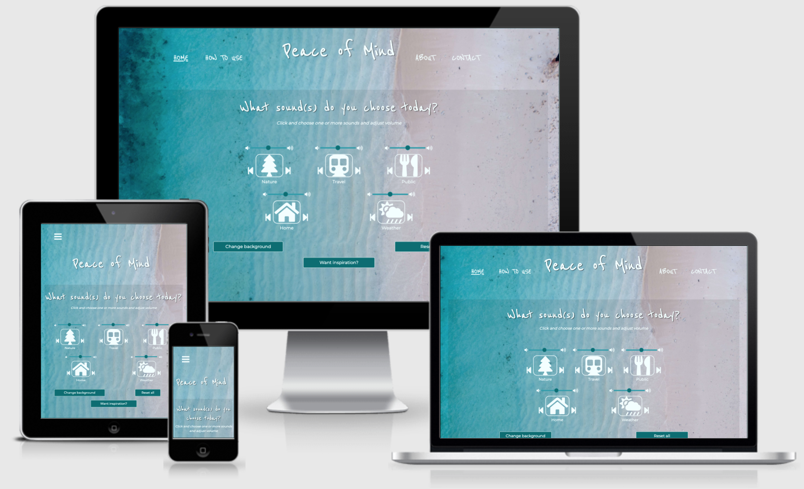
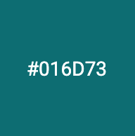
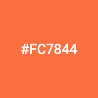

<div align="center"> 

# Peace of Mind

[Peace of Mind](https://potterjane.github.io/peace-of-mind/) is a tool for distration from all of the everyday noises. 
<br>
More specifically, it is a website for users who want to immerse in sound effects, quotes and background videos of nature, public spaces, typical home sounds like a fireplace, and so on. 
<br><br>
The combination of soothing sound effect clips, inspirational quotes and beautiful background videos can increase the user's focus, motivation and productivity, decrease anxiety and stress, and improve mood. 
<br><br>
This website also offer users instruction on how to use the sound effect clips, quotes and background videos, learn more about the company behind the website and what they aim to achieve, and a contact form where users can leave feedback and ask questions about the website. 
<br><br>
The company's motto is "Immerse in sound". Check out the Peace of Mind website [here](https://potterjane.github.io/peace-of-mind/)!
<br>
<p>Responsive mockup of the website</p>


</div>

## Table of Contents
1. [**UX**](#ux)
    - [**Project Goals**](#project-goals)
        - [**User Goals**](#user-goals)
        - [**User Stories**](#user-stories)
        - [**Developer and Business Goals**](#developer-and-business-goals)
    - [**Design Choices**](#design-choices)
    - [**Wireframes**](#wireframes)

2. [**Features**](#features)
    - [**Existing Features**](#existing-features)

3. [**Technologies Used**](#technologies-used)

4. [**Testing**](#testing)

5. [**Deployment**](#deployment)
    - [**How to run this project locally using a command line**](#how-to-run-this-project-locally-using-a-command-line)

6. [**Credits**](#credits)
    - [**Content**](#content)
    - [**Media**](#media)
    - [**Code**](#code)
    - [**Acknowledgements**](#acknowledgements)

7. [**Disclaimer**](#disclaimer)

## UX

### Project Goals

The primary goal of the Peace of Mind website is to provide users a tool for distraction from all of the everyday noises that they can use anytime and anywhere they like - as long as they have Internet access. 
<br>
The design of the website should also reflect the company's theme: the playful and loose look of the primary font combined with the background image and foreground colours of a tropical beach should put users in a serene mood as soon as they enter the website.
<br>
Peace of Mind has two target audiences: New and returning users and also potential new employees who want to help develop the website by, for instance, providing more sound effect clips and background videos that would benefit both the new and returning users.
<br>
Features include:
- Audio clips (of different sound effects such as thunder, rain, fire, crowd walla, keyboard typing, birds chirping, car driving, and so on) with basic music buttons (such as play/stop, volume, previous/next)
- Background videos (of beaches, forest, offices, fireplaces, night sky, and so on) that users can flip through with the help of a button
- Inspirational quotes from famous and anonymous authors that can motivate/inspire users during self-reflection
- Easy-to-use button to reset all of the features/reloads the website
- Easy-to-follow instructions on how to use the website
- Brief background information about the company and its purpose with hyperlinks to other pages on the website
- Social links to provide an alternative way to learn more about the website and to get more 'peer reviews'
- Contact form to give users an opportunity to send feedback or ask questions to the company behind the website
- Sleek and simple 404 error page to make it clear for users when they have navigated to a non-existent webpage

#### User Goals

New and returning user's goals are:
- To understand the theme as soon as they enter the website
- Easy-to-use website with sound effect clips, quotes and background videos directly on the Home page
- Sound effect clips, quotes and background videos that can increase focus, motivation and productivity, decrease anxiety and stress, and improve mood
- A website that is not drowning in too much text, videos, audio or images
- Clear and easy to understand instructions on how to use the website
- A page where they can read more about who is behind the company and what they aim to achieve with the website
- Get a sense of what users think of their website and if it lives up to the company's goals, for example via the company's social media
- A contact page for users to send in their feedback or questions to the company

Potential new employee's goals are:
- Easy-to-use website with sound effect clips, quotes and background videos in order to know what the company's forte is and where there is room for improvement
- A page where they can read more about who is behind the company and what they aim to achieve with the website
- Get a sense of what users think of their website and if it lives up to the company's goals, for example via the company's social media
- A contact page for job seekers to send in their questions and/or attach their resume/CV/portfolio/personal letter

#### User Stories

As a new or returning user, I want:
1. To be able to use the website's sound effect clips, quotes and background videos with as few clicks as possible, so that I can get in to the right head space immediately.
2. To be able to reset all features with one click.
3. To be able to find and follow instructions in an easy way, so that I know how to best use the website.
4. To be able to know the background of the company, so that I understand what they want us to achieve when using the website.
5. To know what other users think of their website, so that I can see what kind of users use the website and why.
6. To be able to contact the company in an easy way, so that I can send any questions or feedback I might have with as few clicks as possible.
7. To have an easy way to navigate back to the Home page, so that if I ever get lost, I can get back to the where I need to be with as few clicks as possible.

As a music/video artist or web developer looking for a job, I want:
8. To be able to use the website's sound effect clips, quotes and background videos in an easy way in order to know what the company's forte is and where there is room for improvement, so that I know how I can potentially collaborate and be a part of the company.
9. To be able to know the background of the company, what other users think of their services via social links, so that I can come to a decision on whether or not to apply for a job with the company.
10. To be able to contact the company in an easy way, so that I can send questions and/or send my resume/CV/portfolio/personal letter.

#### Developer and Business Goals

- A well-thought-out and professional design of the website that attracts new and returning users and also potential new employees.
- To create a website where the audio, videos and quotes are the 'stars'.
- A fun, creative and stylish project that reflects the developer's use of HTML, CSS and Javascript.

### Design Choices

The overall feel of the website should be one that attracts people who are in need of a distraction from everyday noises, not only with the help of sound effect sclips, quotes and background videos, but also from the playful and beach-like style that can be found throughout the website.

**Structure**

- When user enters the website (and before they land on the Home page), they are welcomed by a single question ('How are you feeling?') that is centered on the page in front of the website's thematic and monochromatic background (blue-green shade of cyan). Let's call this page the 'Welcome' pge. This 'Welcome' page acts like an introductory page for user and the question should tell the users immediately what the theme of the website is and also gives the users an opportunity for self-reflection. The question appears with animation effect where it is typed out one letter at a time and after 5 seconds, this 'Welcome' page transitions to the Home page in a fade-out effect.
- The header is always fixed on the top of all the pages of the website, containing the company name at the center and the navigation bar on the left- and right-hand side of the company name.
- From left to right, the navigation bar is in the order of importance. On the company name's left-hand side, you'll find the Home page and How To Use page. On the company name's right-hand side, you'll find the About page and Contact page:
    1. The Home page is the first page that the user lands on after the introductory 'Welcome' page and already here, users can find the heading and main purpose of the website: 'What sound(s) do you choose today?'. <br> Under the heading, there are icons that acts as buttons for the sound effect clips with basic music buttons (such as play/stop, volume, previous/next) surrounding the icons. Beneath each icon, users can find the name of the icons. These names represents the theme of the icon and the collection of their sound effects clips, for example the icon named 'Weather' has sound effect clips of rainfall, thunder, wind, etc. Users can combine a sound effect clip from an icon with a sound effect clip from any other number of icons. For example, they can combine 'Weather' with 'Nature' and 'Home' just by clicking the icons. <br> There are a total of five icons. On desktop and bigger tablet screens, the icons are placed on three columns on the first row and two columns on the second row. On smaller tablet and mobile screens, the five icons are placed vertically on top of each other. <br> Under the icons, there are three buttons placed (almost) next to each other on the center of the page, called 'Change background', 'Want inspiration?' and 'Reset all'. The 'Change background' button changes the background from the the website's thematic beach image to a random video that covers the entire background. With every click, the background changes to a different video. The 'Want inspiration?' button displays a random quote. With every click, the quote changes to a different quote. Users click on the 'Reset all' button when they want to reset the background back to website's beach image, stop displaying quotes and cancel all of the sound effect clips. <br> On smaller mobile screens, the 'Change background' button is removed and disabled in order to create less clutter on the page.
    2. The How To Use page is the second page on the navigation bar. Users click here when they want instructions on how to use the Home page. Under the heading, there are two columns. The left-hand column contains an ordered list of the instructions and the right-hand column contains icons and buttons (intentionally, they do not work on this page). The purpose of these icons and buttons is to illustrate the instructions so each icon or button is placed right next to each numbered list on desktop and bigger tablet screens. <br> On smaller tablet and mobile screens, the icons and buttons are placed right under each numbered list, respectively.
    3. The About page is the third page on the navigation bar. Users click here when they want to read more about who is behind the company and what they want to achieve with their website. Users will also find hyperlinks to the 'How To Use' page and 'Contact' page. <br> The About page looks the same on all screen types (on desktop, tablet and mobile).
    4. The Contact page is the fourth and last page on the navigation bar. Users click here when they want to fill in a contact form to send to the company. The contact form contains the following fields: name, email, file-select and message. All except the file-select are mandatory to fill in before user can click the 'Submit' button. <br> The Contact page looks the same on all screen types (on desktop, tablet and mobile).
- The 404 error page have the same navigation bar with minimal number of text. It informs users that they have 'gotten lost' and can take themselves back to website by clicking on the button, 'Go back to the Home page'.
- The footer is always located at the bottom of all the pages on the website, except for the 404 error page. On the left-hand side, it contains the date of establishment to visualize the age of the company to the users along with the company's social links to Facebook, Instagram, Twitter and LinkedIn. This date of establishment also communicates to users how relatively new the company is and how open they are for feedback and improvement. On the right-hand side, the footer contains the developer's disclaimer and LinkedIn page. On the Home page, the footer also contains the source link for the API quotes.
- All of the pages can only be scrolled vertically and cannot be scrolled horizontally.

**Backgrounds Images/Background Videos**

- The tropical beach image was chosen to represent main colours of the website. The tropical beach colours are typically equated with serenity and sets the overall mood for the users.
- The videos are used solely as background on the Home page when users want to change from the main background image to a video that suits their needs and chosen sound effect clip(s). The videos vary and go on a loop until the user either changes background or resets the website. The following videos that the user can flip through are of: aurora borealise, beach waves, car driving on dry road with mountains on a horizon, fireplace, forest, night sky, blurred people at an office, pink sky, rain on banana leaves, raindrops, close-up of book being flipped through, and sunset by beach.
- The heavily-green concentrated forest image is used as the background for the 404 error page. The 'Got lost?' text fits thematically with the background image. 

**Fonts**

- The primary font called **Reenie Beanie** attracted the developer immediately for its playful, casual and informal look. This look represents the theme of the website and can inspire users in a positive way. The font is readable in any heading sizes.
- The secondary font called **Montserrat** was chosen because it was one of the popular pairings according to [Google Fonts](https://fonts.google.com/specimen/Reenie+Beanie#pairings) but also because the design complements by primary font by being readable for paragraphs or for texts that are smaller than any heading.

**Colours**





<br>

- The white colour (#f2feff) was chosen for the company name, icons, hyperlinks, form and button borders, heading and paragraph elements because the white colour contrast well with the website's main background beach image.
- All the buttons are in a dark blue-green (#016d73) to match with one of the website's main tropical ocean colours. It is also the main background colour for the Welcome section.
- When the 'Change background' button is hovered, its background colour changes from the dark blue-green (#016d73) to the light-blue colour (#299cab), which is also a shade that belongs in a tropical ocean and therefore complements the blue-green shade of cyan colour well.
- When the 'Reset all' button is hovered, its background colour changes from the dark blue-green (#016d73) to an orange-red colour (#fc7844). This colour is typically associated with an action such as 'reset' or 'cancel' and therefore this colour was chosen by the developer.
- The standard red colour was used for the heart icon in the How to Use page, which is considered not a permanent element of the website but it makes the heart icon stand out and emphasize the positive feeling of using the website for the users.

**Icons**

- Icons were primarily used as sound buttons in the Home page to represent the theme of the different sound categories.
- Same icons were used in the How To Use page to illustrate how to use the Home page.
- Icons were also used for the social links in the footer element.

All of the icons were chosen because they are universally understood and because their obvious meaning and purpose removes the need for a more descriptive text.

**Music**

- The sound effect clips found on the Home page are the star of the website, it is part of the tool that is used as a distraction for the users from the everyday noises. The sound clips are played on a loop once the user presses play on the icon and stops playing when user presses stop or 'Reset all'.
- The sound clips are placed in five different categories: Nature, Travel, Public, Home, and Weather. Each category have 6 different sound effect clips, for example, Public has sound clips of crowd walla in an office space, restaurant and traffic noises. 

### Wireframes

These wireframes were created using [Balsamiq](https://balsamiq.com/). 

- [First version](https://github.com/potterjane/peace-of-mind/blob/master/wireframes/pom-wireframes-version-1.pdf) of the mobile, tablet and desktop mockups was made during the design and planning process for this project. 
- [Second version](https://github.com/potterjane/peace-of-mind/blob/master/wireframes/pom-wireframes-version-2.pdf) of the mobile, tablet and desktop mockups was made when the project was almost at the point of completion.
- [Third and final version](https://github.com/potterjane/peace-of-mind/blob/master/wireframes/pom-wireframes-version-3.pdf) of the mobile, tablet and desktop mockups was made when the project was after the point of completion.

For comparison, screenshots of the website on different screen sizes were collected also by using [Balsamiq](https://balsamiq.com/). 
- Screenshots from a desktop screen (Macbook laptop) can be found [here](https://github.com/potterjane/bobs-and-bangs/blob/f9d6725e4f09fd3ce8d388248e187dec21b27512/wireframes/bb-website-desktop.pdf).
- Screenshots from a tablet screen (iPad) can be found [here](https://github.com/potterjane/bobs-and-bangs/blob/ae58108bda48509f1f9123347b45449c4a192631/wireframes/bb-website-tablet.pdf).
- Screenshots from a mobile screen (iPhone X) can be found [here](https://github.com/potterjane/bobs-and-bangs/blob/ae58108bda48509f1f9123347b45449c4a192631/wireframes/bb-website-mobile.pdf). 

### Existing Features
This website has 5 pages (including 404 error page) and 10 features:

Feature 1: Audio clips (of different sound effects such as thunder, rain, fire, crowd walla, keyboard typing, birds chirping, car driving, and so on) with basic music buttons (such as play/stop, volume, previous/next)

This can be found on the Home page. The different sound effects are divided into five different sound themes: Nature, Travel, Public, Home, and Weather.

The screenshot below shows user playing Nature and Weather simultaneously. When sound icon is played, the stop icon is shown. When user clicks the stop icon, the audio clip stops playing and the stop icon is replaced with the respective sound icon. User can adjust the volume with the slider above the sound icons. Users can click the previous/next buttons to play the next random sound effect and these buttons are located on the left/right side of the sound icon.
<br>


User stories covered by this feature:
1. As a new or returning user, I want to be able to use the website's sound effect clips, quotes and background videos with as few clicks as possible, so that I can get in to the right head space immediately.
8. As a music/video artist or web developer looking for a job, I want to be able to use the website's sound effect clips, quotes and background videos in an easy way in order to know what the company's forte is and where there is room for improvement, so that I know how I can potentially collaborate and be a part of the company.

Feature 2: Background videos (of beaches, forest, offices, fireplaces, night sky, and so on) that users can flip through with the help of a button

This can also be found on the Home page. The different background videos are played at random when user clicks the 'Change background' button.

The screenshot below shows user playing a random background video after they have clicked the 'Change background' button. The video will be played on a loop until user either clicks the button again to get a new random background video or when user clicks the 'Reset all' button.
<br>


User stories covered by this feature:
1. As a new or returning user, I want to be able to use the website's sound effect clips, quotes and background videos with as few clicks as possible, so that I can get in to the right head space immediately.
8. As a music/video artist or web developer looking for a job, I want to be able to use the website's sound effect clips, quotes and background videos in an easy way in order to know what the company's forte is and where there is room for improvement, so that I know how I can potentially collaborate and be a part of the company.

Feature 3: Inspirational quotes from famous and anonymous authors that can motivate/inspire users during self-reflection

This is also found on the Home page. The inspirational quotes are played at random whe user clicks the 'Want inspiration?' button.

The screenshot below shows user playing a random quote with corresponding author after they have clicked the 'Want inspiration?' button. The quote remains in display until user either clicks the button again to get a new random quote or when user clicks the 'Reset all' button.
<br>


User stories covered by this feature:
1. As a new or returning user, I want to be able to use the website's sound effect clips, quotes and background videos with as few clicks as possible, so that I can get in to the right head space immediately.
8. As a music/video artist or web developer looking for a job, I want to be able to use the website's sound effect clips, quotes and background videos in an easy way in order to know what the company's forte is and where there is room for improvement, so that I know how I can potentially collaborate and be a part of the company.

Feature 4: Easy-to-use button to reset all of the features/reloads the website

This is also found on the Home page. The 'Reset all' button reloads the button and therefore resets all of the features listed previously (1-3).

The screenshot below shows user clicking on the 'Reset all' button and showing the website after it has been reloaded.
<br>


User stories covered by this feature:
2. As a new or returning user, I want to be able to reset all features with one click.

Feature 5: Easy-to-follow instructions on how to use the website

This is found on the How To Use page. The left-hand column contains an ordered list of the instructions and the right-hand column contains icons and buttons (intentionally, they do not work on this page). The purpose of these icons and buttons is to illustrate the instructions.
<br>


User stories covered by this feature:
3. As a new or returning user, I want to be able to find and follow instructions in an easy way, so that I know how to best use the website.

Feature 6: Brief background information about the company and its purpose with hyperlinks to other pages on the website

This is found on the About page. Simple and straight-forward information about what the company is and what they aim to achieve with their features. There are hyperlinks to the How To Use page and Contact page at the end.
<br>


User stories covered by this feature:
4. As a new or returning user, I want to be able to know the background of the company, so that I understand what they want us to achieve when using the website.
9. As a music/video artist or web developer looking for a job, I want to be able to know the background of the company, what other users think of their services via social links, so that I can come to a decision on whether or not to apply for a job with the company.

Feature 7: Social links to provide an alternative way to learn more about the website and to get more 'peer reviews'

Social links are found in the Footer section on all of the pages except the 404 error page. The links open in a new tab to the respective home page since there actually is no real 'Peace of Mind' social links. On the Home page, there is a source link to the quotes API since the quotes are retrieved via this page. There is also a date of establishment and disclaimer from the developer, with developer's LinkedIn page.
<br>


User stories covered by this feature:
5. As a new or returning user, I want to be able to know what other users think of their website, so that I can see what kind of users use the website and why.
9. As a music/video artist or web developer looking for a job, I want to be able to know the background of the company, what other users think of their services via social links, so that I can come to a decision on whether or not to apply for a job with the company.

Feature 8: Contact form to give users an opportunity to send feedback or ask questions to the company behind the website

This is found on the Contact page. All fields are required except the file upload field before user can submit the form. Automated data validation is implemented with the help of the required input attribute. When all the fields are field in correctly, an alert message pops up on the page informing user that the message is sent successfully. When an error occurs, an alert message pops up on the page informing user that the message was not sent successfully.s
<br>


User stories covered by this feature:
6. As a new or returning user, I want to be able to contact the company in an easy way, so that I can send any questions or feedback I might have with as few clicks as possible.
10. As a music/video artist or web developer looking for a job, I want to be able to contact the company in an easy way, so that I can send questions and/or send my resume/CV/portfolio/personal letter.

Feature 9: Sleek and simple 404 error page to make it clear for users when they have navigated to a non-existent webpage

This appears when user navigates themselves to a non-existent webpage. The 404 error page contains only two short sentences, a button to take them back to the Home page, and the navigation bar at the top of the page.
<br>


User stories covered by this feature:
7. To have an easy way to navigate back to the Home page, so that if I ever get lost, I can get back to the where I need to be with as few clicks as possible.

### Future Features

- Videos to work as background feature for mobile devices without creating clutter on the page
- Have a pause button so that users can resume the audio from where they paused the audio
- Background videos that fully cover screen sizes that are larger than 1920px in width and 1080px in height
- Have EmailJS subscription that gives the developer the ability to receive files from users who fill in the form via Contact page
- Volume sliders that work on iPhone models that are older than iPhone 8

## Technologies Used

**This project used:**
- Primarily HTML, CSS and JavaScript programming languages. 
- [jQuery](https://jquery.com/)'s JavaScript library, version 3.6.
- [Bootstrap](https://getbootstrap.com/docs/5.0/getting-started/introduction/)'s CSS and Javascript library, version 5.0.
- [Google Fonts](https://fonts.google.com/) to style the website's fonts.
- [Font Awesome](https://fontawesome.com/)'s free kit of icons.
- Different [Youtube](https://www.youtube.com/) channels for their royalty-free/copyright-free/under Creative Commons (CC0) license sound effects.
- [SoundBible](https://soundbible.com/2178-Crackling-Fireplace.html)'s user Daniel Simion's royalty-free fireplace audio.
- [Pexels](https://www.pexels.com/) for free videos and images.
- [Web FX](https://www.webfx.com/web-design/color-picker/)'s color picker.
- [GitHub](https://github.com/) to store and share all project codes.
- [GitPod](https://www.gitpod.io/) for their IDE (integrated development environment) while building the website.
- [W3C Markup Validation Service](https://validator.w3.org/) to validate all HTML code.
- [W3C CSS Validation Service](https://jigsaw.w3.org/css-validator/) to validate all CSS code.
- [JSHint](https://jshint.com/) tool to help detect errors and potential problems in all JavaScript code.
- [Lighthouse Chrome Devtools](https://developers.google.com/web/tools/lighthouse#devtools) to evaluate the accessibilty on all of the website's pages.
- [WAVE Web Accessibility Evaluation Tool](https://wave.webaim.org/) was also used to evaluate the accessibilty on all of the website's pages

## Testing 

This information can be found in separate [testing.md](testing.md) file.

## Deployment

This project was created and developed using the [GitPod IDE](https://www.gitpod.io/), and then added, committed and pushed to [GitHub](https://github.com/) to store and share all project codes.

The followings steps were taken by the developer in order to deploy Peace of Mind to GitHub Pages:
1. Log into GitHub
2. Choose from the list the repositories, [peace-of-mind](https://github.com/potterjane/peace-of-mind)
3. Select 'Settings' from this repository's menu bar.
4. Scroll down to the 'GitHub Pages' section and click the link.
5. Under 'Source' and from the drop-down menu labelled 'None', select the 'master' branch and then click 'Save'.
6. When the page is refreshed, retrieve the link to the [deployed website](https://potterjane.github.io/peace-of-mind/). 

### How to run this project locally using a command line

The project can be run locally by cloning the repository from GitHub. Below are the steps that the developer took to clone this project using HTTPS and the command line. 
Read this [GitHub document](https://docs.github.com/en/github/creating-cloning-and-archiving-repositories/cloning-a-repository) to find other ways to run this project locally.

1. Log into GitHub
2. Choose from the list the repositories, [peace-of-mind](https://github.com/potterjane/peace-of-mind)
3. From the drop-down menu labelled 'Code', select the HTTPS section and then click on the icon to copy the URL of the repository.
4. Open the local terminal.
5. Change the current working directory to the location where the cloned directory is to be stored.
6. When directory has been changed and location is selected, type ```git clone``` and then paste the URL of the repository that was copied in step 3.
```console
git clone https://github.com/potterjane/peace-of-mind.git
```
7. Press 'Enter'.

## Credits

### Content

- All text in this project was written by the developer.

### Media

#### Music

The sound clips were sourced from the following channels and creators:

#### Videos
The videos were sourced from Pexels from the following creators:

### Images
The images were sourced from Pexels from the following creators:

### Code
- How to keep footer where it belongs: https://www.freecodecamp.org/news/how-to-keep-your-footer-where-it-belongs-59c6aa05c59c/ 
- How to clear form after it has been submitted: https://www.tutorialspoint.com/How-to-reset-or-clear-a-form-using-JavaScript 
- How to use JS to cycle through background videos with a button: https://stackoverflow.com/questions/41643895/use-javascript-to-cycle-through-video-backgrounds-and-change-css 
- How to press play/pause: https://www.w3schools.com/howto/howto_css_fullscreen_video.asp 
- Informed which audio and video formats supports which browser: https://www.w3schools.com/html/html_media.asp MP3 is supported by all browsers
- How to create intro/welcome screen (splash screen): https://www.youtube.com/watch?v=MOlaldp1Fv4&ab_channel=ConorBailey 
- How to use JS to type out one letter at a time: https://www.youtube.com/watch?v=HjVVD8E84Kk&ab_channel=MaximusMcCullough 
- How to create fullscreen background video: https://www.w3schools.com/howto/howto_css_fullscreen_video.asp 
- How to add multiple video sources in Javascript: http://burnignorance.com/html-tips/how-to-play-multiple-videos-in-a-loop-using-html5-and-javascript/ 
- How to make sure that the Welcome section appears once per visit and not every time user reloads or clicks on Home on nabber: https://www.sitepoint.com/community/t/display-splash-preloader-screen-once-per-visit/266148 
- Random videos from array: https://www.kirupa.com/html5/picking_random_item_from_array.htm 
- Object keys: https://javascript.info/keys-values-entries 
- Set attributes: https://www.w3schools.com/jsref/met_element_setattribute.asp 
- How to add volume slider in HTML and control volume via JS: https://stackoverflow.com/questions/62160275/js-audio-volume-slider 
- Customise the volume slider in CSS: https://www.cssportal.com/style-input-range/ 
- How to clear form after every submit: https://www.w3schools.com/jsref/met_form_reset.asp
- How to reload page using JS: https://stackoverflow.com/questions/3715047/how-to-reload-a-page-using-javascript#:~:text=To%20reload%20the%20page%20keeping,reload()%3B
- How to toggle audio play and pause with one button in JS: https://stackoverflow.com/questions/27368778/how-to-toggle-audio-play-pause-with-one-button-or-link
- How to add 404 page in HTML: https://www.youtube.com/watch?v=kPtS4vO42II&ab_channel=DaniKrossing 
- How to add side collapse navbar: https://www.w3schools.com/howto/howto_js_collapse_sidebar.asp 
- More instructions on how to implement quote API: https://www.sololearn.com/Discuss/2419539/here-the-following-api-includes-quotes-how-to-generate-random-quote-here-i-m-just-able-to-generate
- Placeholder text color: https://www.w3schools.com/howto/howto_css_placeholder.asp 
- Free quotes: https://forum.freecodecamp.org/t/free-api-inspirational-quotes-json-with-code-examples/311373 & https://type.fit/api/quotes 
- Root path etc: https://stackoverflow.com/questions/4810927/how-to-go-up-a-level-in-the-src-path-of-a-url-in-html 
- How to remove class: https://www.w3schools.com/jquery/html_removeclass.asp 
- How to shorten horizontal sides: https://stackoverflow.com/questions/38502050/how-to-adjust-the-width-of-a-horizontal-rule-element 
- How to add two on submit functions: https://stackoverflow.com/questions/11806253/onsubmit-multiple-javascript-functions 
- Form Validation: https://www.w3schools.com/js/js_validation.asp 

### Acknowledgements

Special thanks to: 
- Code Institute Mentor Mo for all of his time and for offering his support and suggestions on what this developer needs to focus on in order to get distinction grade on this project.
- Boyfriend Fredrik, friends Alex and Emelie, sisters Marie and Erin and dad for testing the website and giving this developer both positive and constructive feedback.

#### Disclaimer
The content of this website, including the sound effect clips, images and videos used, are for educational purposes only.