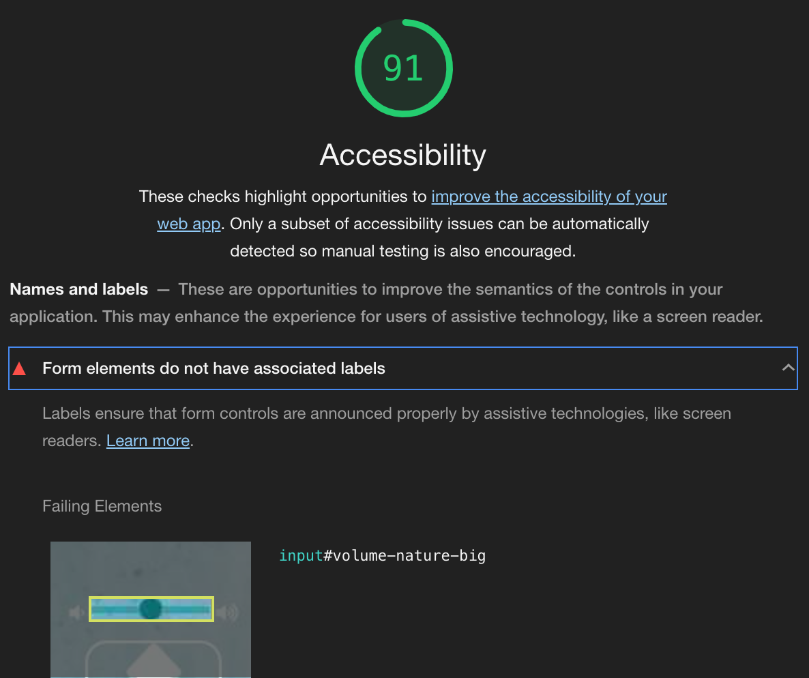
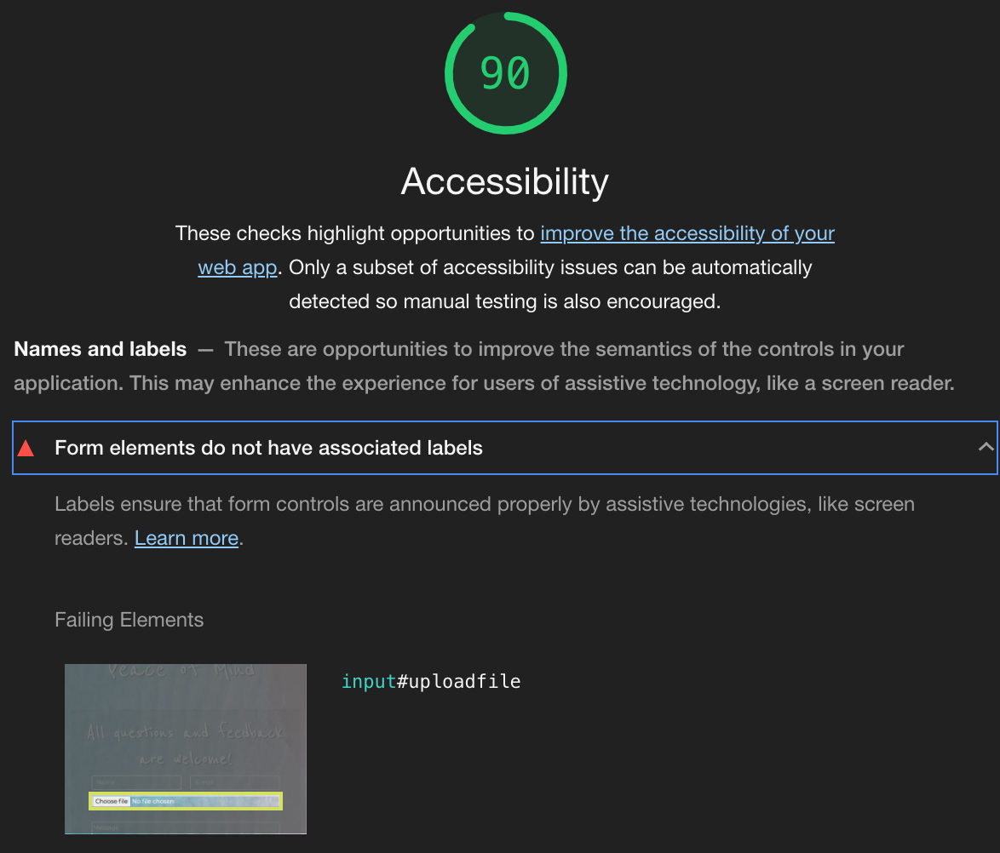
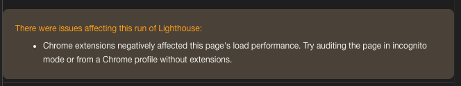

# Peace of Mind - Testing details

Click [here](README.md) for the website's README file

View the website [here](https://potterjane.github.io/peace-of-mind/)

## Table of Contents

1. [**Automated Testing**](#automated-testing)
    - [**Validation services**](#validation-services)
    - [**Accessibility services**](#accessibilty-services)
    - [**Other Evaluation services via Lighthouse**](#other-evaluation-services-via-lighthouse)
2. [**User Stories Testing**](#user-stories-testing)
3. [**Manual Testing**](#manual-testing)
    - [**Testing on desktop screens**](#testing-on-desktop-screens)
    - [**Testing on tablet and phone screens**](#testing-on-tablet-and-phone-screens)
4. [**Bugs discovered**](#bugs-discovered)
    - [**Solved bugs**](#solved-bugs)
    - [**Unsolved bugs**](#unsolved-bugs)
5. [**Further Testing**](#further-testing)

## Automated Testing

### Validation services
- [W3C Markup Validation](https://validator.w3.org/) was used to validate all the HTML pages. Copied all the code from an html page, pasted it in the field under 'Validate by direct input' and then clicked on the 'Check' button.
**For this website, no errors or warnings to show on any of the HTML pages.**
- [W3C CSS validation](https://jigsaw.w3.org/css-validator/) was used to validate CSS. Copied all the code from the css page, pasted it in the field under 'By direct input' and then clicked on the 'Check' button.
**For this website, no errors or warnings to show on the CSS page.**
- [JSHint](https://jshint.com/) was used to validate all the JS pages. Copied all the code from a JS page, pasted it in the left-side of the tool.
**For this website, no errors or warnings to show on any of the JS pages.**

### Accessibility services
- [Lighthouse in ChromeDev Tools](https://developers.google.com/web/tools/lighthouse#devtools) was used to evaluate the accessibilty on all of the website's page in incognito mode, as recommended (see screenshot below).
In order to run a Lighthouse report, open Google Chrome, go to the URL for [Peace of Mind](https://potterjane.github.io/peace-of-mind/) and then open Chrome DevTools. 
Change from the Elements tab to the Lighthouse tab (You might need to click on 'right arrows' icon to access this tab). Choose at least one category and a device and then click on 'Generate report'.
**The report generated an Accessibility rate of 100 out of 100 for the following pages: 404 error page, How To Use page, and About page.**
**The Home page generated an Accessibility rate of 91 out of 100 and the Contact page generated an Accessibility rate of 90 out of 100. Both pages got this rating for the same reason**

<div align="center"><h4>Accessibility rating for Home page</h4>

</div>
<div align="center"><h4>Accessibility rating for Contact page</h4>

</div>

As you can see here, the form elements do actually have associated labels but the label element has been set to ```label{display: none;}``` in CSS. Since the accessibility rating has a valid reason but cannot be 'fixed' without changing the design of the pages, this developer chose to leave it on this Accessibility rating.

**Snippet of the HTML for Home page**
```html
<div class="row">
  <!--Travel sounds-->
  <div class="travel col">
    <i class="fas fa-volume-down"></i>
    <label for="volume-travel-small">Volume</label>
    <input type="range" id="volume-travel-small"> <!--Code taken from StackOverflow on how to add volume slider in HTML-->
    <i class="fas fa-volume-up"></i>
    <br>
    <i class="fas fa-step-backward" onclick="randomTravelSmall()"></i><i id="travel-icon-small" class="fas fa-fw fa-subway main-icon"></i><i class="fas fa-step-forward" onclick="randomTravelSmall()"></i>
    <audio loop id="travel-sound-small">
      <source src="#" type="audio/mp3" id="sourceTravelSmall">
      Your browser does not support embedded audio.
    </audio>
    <p>Travel</p>
  </div>
</div>
```
**Snippet of the HTML for Contact page**
```html
<div class="row">
  <div class="col">
    <label for="uploadfile" class="upload-label">Want to send us something?</label>
    <input type="file" id="uploadfile" name="uploadfile">
  </div>
</div>
```

- [WAVE Web Accessibility Evaluation Tool](https://wave.webaim.org/) was also used to evaluate the accessibilty on all of the website's pages in incognito mode. You simply need to write the URL for [Peace of Mind](https://potterjane.github.io/peace-of-mind/) and then press 'Enter' to get the results.
**The results were no errors were detected for this website.**

<div align="center"><h4>Lighthouse error outside incognito mode</h4>

</div>

### Other Evaluation services via Lighthouse
- [Lighthouse in ChromeDev Tools](https://developers.google.com/web/tools/lighthouse#devtools) was also used to evaluate performance, best practices and SEO on all of the website's pages in incognito mode.
**The report generated a Performance rate an average of 94.7 out of 100 for this website.**
**The report generated a Best Practices rate of 100 out of 100 for this website.**
**The report generated a SEO rate of 100 out of 100 for this website.**

## User Stories Testing
In this section, this developer manually tested all the user stories described on the [README](README.md) page, under the UX section.

1. As a new or returning user, I want to be able to use the website's sound effect clips, quotes and background videos with as few clicks as possible, so that I can get in to the right head space immediately.
8. As a music/video artist or web developer looking for a job, I want to be able to use the website's sound effect clips, quotes and background videos in an easy way in order to know what the company's forte is and where there is room for improvement, so that I know how I can potentially collaborate and be a part of the company.

| Feature | Action | Expected result | Actual result |
| ------------- | ------------- | -------------   | ------------- |
| On the Home page, find the sound effects | Click on one of the sound effects icon or its corresponding previous/next button | A random sound effect is playing and the type of sound effect matches the theme of the sound effects icon. The sound effects icon is also replaced with a stop icon | Works as expected |
| On the Home page, find the stop button | Click on one of the sound effects icon or its corresponding previous/next button and then click the same sound effects icon to stop playing the sound effect | When user clicks the stop icon, the sound effect stops playing immediately | Works as expected |
| On the Home page, find the volume slider | Click on one of the sound effects icon or its corresponding previous/next button and then move the volume slider left and right | When user moves the volume slider to the left, it decreases the volume and when user moves it to the right, it increases the volume | Works as expected |
| On the Home page, find the background images | Click on the 'Change background' button | A random video is playing in the background of the page, muted and on a loop until user clicks on the button again to change to a different background video | Works as expected |
| On the Home page, find the quotes | Click on the 'Want inspiration?' button | A random quote and its author is displayed under the button. It remains on display until user clicks on the button again to change to a different quote | Works as expected |

<br>

2. As a new or returning user, I want to be able to reset all features with one click.

| Feature | Action | Expected result | Actual result |
| ------------- | ------------- | -------------   | ------------- |
| On the Home page, start playing one or several of the sound effects via their icon and then find the 'Reset all' button | Click on the 'Reset all' button | When a sound effect clip is playing, click on the button to cancel the action/reload the page  | Works as expected |
| On the Home page, start playing a background video by clicking on the 'Change background' button and then find the 'Reset all' button | Click on the 'Reset all' button | When a background video is playing, click on the button to cancel the action/reload the page | Works as expected |
| On the Home page, start displaying a random quote by clicking on the 'Want inspiration?' button and then find the 'Reset all' button | Click on the 'Reset all' button | When a quote and its author is on display, click on the button to cancel the action/reload the page | Works as expected |

<br>

3. As a new or returning user, I want to be able to find and follow instructions in an easy way, so that I know how to best use the website.

| Feature | Action | Expected result | Actual result |
| ------------- | ------------- | -------------   | ------------- |
| Find the How To Use page | Click on 'How To Use' on the top of the page in the navigation section | To send user to the How To Use page where and ordered list of instructions and its corresponding icons/button to illustrate the instructions are seen | Works as expected |

<br>

4. As a new or returning user, I want to be able to know the background of the company, so that I understand what they want us to achieve when using the website.
9. As a music/video artist or web developer looking for a job, I want to be able to know the background of the company, so that I can come to a decision on whether or not to apply for a job with the company.

| Feature | Action | Expected result | Actual result |
| ------------- | ------------- | -------------   | ------------- |
| Find the About page | Click on 'About' on the top of the page in the navigation section | To send user to the About page where background information about the website and what they aim to achieve is seen | Works as expected |

<br>

5. As a new or returning user, I want to know what other users think of their website, so that I can see what kind of users use the website and why.

| Feature | Action | Expected result | Actual result |
| ------------- | ------------- | -------------   | ------------- |
| Find the social links in the footer section of the Home page | Scroll down and click on one of the social icons on the left-hand side of the page  | When clicked the home page of the equivalent social link is opened on a new tab | Works as expected |
| Find the social links in the footer section of the How To Use page | Scroll down and click on one of the social icons on the left-hand side of the page  | When clicked the home page of the equivalent social link is opened on a new tab | Works as expected |
| Find the social links in the footer section of the About page | Scroll down and click on one of the social icons on the left-hand side of the page  | When clicked the home page of the equivalent social link is opened on a new tab | Works as expected |
| Find the social links in the footer section of the Contact page | Scroll down and click on one of the social icons on the left-hand side of the page  | When clicked the home page of the equivalent social link is opened on a new tab | Works as expected |

<br>

6. As a new or returning user, I want to be able to contact the company in an easy way, so that I can send any questions or feedback I might have with as few clicks as possible.
10. As a music/video artist or web developer looking for a job, I want to be able to contact the company in an easy way, so that I can send questions and/or send my resume/CV/portfolio/personal letter.

| Feature | Action | Expected result | Actual result |
| ------------- | ------------- | -------------   | ------------- |
| Find the Contact page | Click on 'Contact' on the top of the page in the navigation section | To send user to the Contact page where an unfilled form is seen | Works as expected |
| Fill in the Contact page with correct input data  | Fill in all the required fields, attach a file and then click 'Submit' button | After submission, form is completely cleared and user gets an alert message that says 'Message successfully sent!'| Works as expected |
| Fill in the Contact page with correct input data | Fill in all the required fields, do not attach a file and then click 'Submit' button | After submission, form is completely cleared and user gets an alert message that says 'Message successfully sent!'| Works as expected |
| Fill in the Contact page with incorrect input data | Fill in all the required fields except for 'Name' field and then click 'Submit' button | To receive a pop-up error message under the 'Name' field that states 'Please fill in this field'| Works as expected |
| Fill in the Contact page with incorrect input data | Fill in all the required fields except for 'E-mail' field and then click 'Submit' button | To receive a pop-up error message under the 'E-mail' field that states 'Please fill in this field' alternatively 'Please include an "@" in the email address' | Works as expected |
| Fill in the Contact page with incorrect input data | Fill in all the required fields except for 'Message' field and then click 'Submit' button | To receive a pop-up error message under the 'Message' field that states 'Please fill in this field'| Works as expected |

<br>

7. To have an easy way to navigate back to the Home page, so that if I ever get lost, I can get back to the where I need to be with as few clicks as possible.

| Feature | Action | Expected result | Actual result |
| ------------- | ------------- | -------------   | ------------- |
| On the 404 error page, find the button to the Home page | Click on the 'Go back to the Home page' button | To send user back to the Home page | Works as expected |
| Open the 404 error page, find the navigation bar | Go to the top of the page and click on any links in the navigation bar  | To send user to the selected existing page on the website | Works as expected |

<br>

## Manual Testing

### Testing on desktop screens
Several tests were done on a smaller laptop screen and a bigger stationary computer screen and on the following browsers: Brave, Chrome, Edge, Firefox and Opera.
[Here](https://github.com/potterjane/bobs-and-bangs/blob/f9d6725e4f09fd3ce8d388248e187dec21b27512/wireframes/bb-website-desktop.pdf) you can find all of the screenshots of the website on a desktop screen (Macbook laptop). These screenshots were collected using [Balsamiq](https://balsamiq.com/). You can compare the desktop screenshots 
with the [second and final version](https://github.com/potterjane/bobs-and-bangs/blob/f1370748e2ef25d35dbc62a0b01a8b6aca7fa1b8/wireframes/bb-wireframes-version-2.pdf) of the wireframes.

This developer followed these steps:

1. Booking form on Booking page
    * Go to the Booking page
    * Submit the form without filling any of the fields and verify that an error message about the required fields appears
    * Submit the form with letters or symbols in the 'Phone number' field and verify that an error message about invalid phone number appears
    * Submit the form with just letters and no '@' symbol or with letters before but not after the '@' symbol in the 'E-mail address' field and verify that an error message about invalid e-mail address appears
    * Submit the form without choosing a date in the 'Choose date' field and verify that an error message about the required fields appears
    * Submit the form without choosing a service in the 'Choose service' field and verify that an error message about the required fields appears
    * Submit the form with all fields filled in with valid inputs and verify that the form 'clears' when clicking the 'Submit' button. This action is expected and correct in this project.
    * Submit the form with all fields, except the 'Specific requirements' field, filled in with valid inputs and verify that the form 'clears' when clicking the 'Submit' button. This action is also expected and correct in this project.

2. Booking form on Home page
    * Go to the Home page
    * Click on the 'Book Now' modal button
    * Check that the form appears in the center of the page and the rest of the Home page becomes a backdrop
    * Check that you can click anywhere on the backdrop to exit the form
    * Submit the form without filling any of the fields and verify that an error message about the required fields appears
    * Submit the form with letters or symbols in the 'Phone number' field and verify that an error message about invalid phone number appears
    * Submit the form with just letters and no '@' symbol or with letters before but not after the '@' symbol in the 'E-mail address' field and verify that an error message about invalid e-mail address appears
    * Submit the form without choosing a date in the 'Choose date' field and verify that an error message about the required fields appears
    * Submit the form without choosing a service in the 'Choose service' field and verify that an error message about the required fields appears
    * Submit the form with all fields filled in with valid inputs and verify that the form 'clears' when clicking the 'Submit' button. This action is expected and correct in this project.
    * Submit the form with all fields, except the 'Specific requirements' field, filled in with valid inputs and verify that the form 'clears' when clicking the 'Submit' button. This action is also expected and correct in this project.

3. Review carousel on Home page
    * Go to the Home page and scroll down to the review carousel
    * Check that the reviews are cycling through automatically
    * Check that when you hold down the mouse button over a review, it stops cycling through
    * Check that when you click on an indicator below the carousel, it takes you to the corresponding review
    * Check that when you move your mouse away from the reviews, they are cycling through again automatically

4. Image carousel on About page
    * Go to the About page
    * Check that the images are cycling through automatically
    * Check that when you hold down the mouse button over an image, it stops cycling through
    * Check that when you move your mouse away from the images, they are cycling through again automatically

5. Contact form on Contact page
    * Go to the Contact page
    * Submit the form without filling any of the fields and verify that an error message about the required fields appears
    * Submit the form with all fields, except the 'Message' field, filled in and verify that an error message about the required fields appears
    * Submit the form with just letters and no '@' symbol or with letters before but not after the '@' symbol in the 'E-mail address' field and verify that an error message about invalid e-mail address appears
    * Submit the form with all fields filled in with valid inputs and verify that the form 'clears' when clicking the 'Send' button. This action is expected and correct in this project.

6. Links on Contact page
    * Go to the Contact page
    * Check that all the links either opens an external application or opens a new tab

7. Links on footer section
    * Go to any page and scroll down to the footer section
    * Check that all the links either opens an external application or opens a new tab

8. Embedded Google Maps
    * Go to the Contact page
    * Check that the embedded Google Maps is displayed and shows the correct address
    * Check that you can zoom in and out of the Maps
    * Check that you can click on 'View larger map' to open Google Maps in a new tab

9. Videos on Services page
    * Go to the Services page
    * Check that the videos are displayed and there are no broken links
    * Check that the controls are working by pressing the play/pause button, volume, fullscreen toggle, etc
    * Check that when you press play, the videos remain muted and is on a loop until you press pause
    * Check that you cannot unmute the videos

10. Navigation
    * Go to any page
    * On the top-left of the page, check that you see the company logo, 'B&B' with the first 'B' and '&' colored in white (blanchealmond) and
    the second 'B' colored in light purple (#b288ca)
    * Check that when you hover over the company logo, the entire logo turns to the same light purple color (#b288ca)
    * Check that when you click on the company logo, you stay or end up on the Home page
    * On the top-right of the page, check that you see all 5 navigation links to 'Home', 'About', 'Services', 'Contact' and 'Booking',
    all colored in white (blanchealmond) and all horizontally-aligned
    * Check that when you hover over one of the navigation links, it turns to the light purple color (#b288ca)
    * Check that when you click on one of the navigation links, it takes you to the corresponding page

### Testing on mobile screens
Several tests were done on a Huawei mobile screen and an iPhone 6 mobile screen and on the following browsers: Chrome, Safari and via Facebook Messenger.
You can find all of the screenshots of the website on Chrome DevTools' tablet (iPad) [here](https://github.com/potterjane/bobs-and-bangs/blob/ae58108bda48509f1f9123347b45449c4a192631/wireframes/bb-website-tablet.pdf) 
and for mobile screen (iPhone X) [here](https://github.com/potterjane/bobs-and-bangs/blob/ae58108bda48509f1f9123347b45449c4a192631/wireframes/bb-website-mobile.pdf). You can compare the mobile screenshots 
with the [second and final version](https://github.com/potterjane/bobs-and-bangs/blob/f1370748e2ef25d35dbc62a0b01a8b6aca7fa1b8/wireframes/bb-wireframes-version-2.pdf) of the wireframes.

This developer followed these steps:

1. Booking form on Booking page
    * Go to the Booking page
    * Submit the form without filling any of the fields and verify that an error message about the required fields appears
    * Submit the form with letters or symbols in the 'Phone number' field and verify that an error message about invalid phone number appears
    * Submit the form with just letters and no '@' symbol or with letters before but not after the '@' symbol in the 'E-mail address' field and verify that an error message about invalid e-mail address appears
    * Submit the form without choosing a date in the 'Choose date' field and verify that an error message about the required fields appears
    * Submit the form without choosing a service in the 'Choose service' field and verify that an error message about the required fields appears
    * Submit the form with all fields filled in with valid inputs and verify that the form 'clears' when clicking the 'Submit' button. This action is expected and correct in this project.
    * Submit the form with all fields, except the 'Specific requirements' field, filled in with valid inputs and verify that the form 'clears' when clicking the 'Submit' button. This action is also expected and correct in this project.

2. Booking form on Home page
    * Go to the Home page
    * Click on the 'Book Now' modal button
    * Check that the form appears in the center of the page and the rest of the Home page becomes a backdrop
    * Check that you can click anywhere on the backdrop to exit the form
    * Submit the form without filling any of the fields and verify that an error message about the required fields appears
    * Submit the form with letters or symbols in the 'Phone number' field and verify that an error message about invalid phone number appears
    * Submit the form with just letters and no '@' symbol or with letters before but not after the '@' symbol in the 'E-mail address' field and verify that an error message about invalid e-mail address appears
    * Submit the form without choosing a date in the 'Choose date' field and verify that an error message about the required fields appears
    * Submit the form without choosing a service in the 'Choose service' field and verify that an error message about the required fields appears
    * Submit the form with all fields filled in with valid inputs and verify that the form 'clears' when clicking the 'Submit' button. This action is expected and correct in this project.
    * Submit the form with all fields, except the 'Specific requirements' field, filled in with valid inputs and verify that the form 'clears' when clicking the 'Submit' button. This action is also expected and correct in this project.

3. Review carousel on Home page
    * Go to the Home page and scroll down to the review carousel
    * Check that the reviews are cycling through automatically
    * Check that when you hold down over a review, it stops cycling through
    * Check that when you click on an indicator below the carousel, it takes you to the corresponding review
    * Check that when you move away from the reviews, they are cycling through again automatically

4. Image carousel on About page
    * Go to the About page
    * Check that the images are cycling through automatically
    * Check that when you hold down over an image, it stops cycling through
    * Check that when you move away from the images, they are cycling through again automatically

5. Contact form on Contact page
    * Go to the Contact page
    * Submit the form without filling any of the fields and verify that an error message about the required fields appears
    * Submit the form with all fields, except the 'Message' field, filled in and verify that an error message about the required fields appears
    * Submit the form with just letters and no '@' symbol or with letters before but not after the '@' symbol in the 'E-mail address' field and verify that an error message about invalid e-mail address appears
    * Submit the form with all fields filled in with valid inputs and verify that the form 'clears' when clicking the 'Send' button. This action is expected and correct in this project.

6. Links on Contact page
    * Go to the Contact page
    * Check that all the links either opens an external application or opens a new tab

7. Links on footer section
    * Go to any page and scroll down to the footer section
    * Check that all the links either opens an external application or opens a new tab

8. Embedded Google Maps
    * Go to the Contact page
    * Check that the embedded Google Maps is displayed and shows the correct address
    * Check that you can zoom in and out of the Maps
    * Check that you can click on 'View larger map' to open Google Maps in a new tab

9. Images on Services page
    * Go to the Services page
    * Check that the images are displayed and there are no broken links

10. Navigation
    * Go to any page
    * On the top-left of the page, check that you see the company logo, 'B&B' with the first 'B' and '&' colored in white (blanchealmond) and
    the second 'B' colored in light purple (#b288ca)
    * Check that when you click on the company logo, the entire logo turns to the same light purple color (#b288ca) and you either
    stay or end up on the Home page
    * On the top-right of the page, check that you see a navbar or a 'hamburger' 
    * Check that when you click on the navbar/'hamburger', it uncollapses and shows all 5 navigation links to 'Home', 'About', 'Services', 'Contact' and 'Booking',
    all colored in white (blanchealmond), all vertically-aligned
    * Check that when you click on the navbar/'hamburger' again, it collapses and hides all 5 navigation links
    * Check that when you click on one of the navigation links, it turns to the light purple color (#b288ca) and it takes you to the corresponding page.

## Bugs discovered

### Solved bugs
1. **Jumping behaviour on the uncollapsed navbar**

    When collapsing and uncollapsing the navbar for mobile and tablet screens, the entire ul presented a 'jump' behaviour.

    **How this developer fixed it:**

    With the help of the [SimplySmartMedia](https://simplysmartmedia.com/2016/06/heres-why-your-bootstrap-collapsed-alert-jumps-when-expanded/)'s post, 
    the ```class="nav-container-collapse"``` was moved from the ```<ul>``` element to the grandparent ```<div>``` element.

    ```html
        <div class="collapse nav-container-collapse" id="navbarToggleExternalContent">
            <div class="p-4">
                <nav>
                    <ul>
                        <li class="row"> 
                            <a class="col-12" href="index.html"><p>home</p></a>
                        </li>
                        <li class="row"> 
                            <a class="col-12" href="about.html"><p>about</p></a>
                        </li>
                        <li class="row"> 
                            <a class="col-12" href="services.html"><p>services</p></a>
                        </li>
                        <li class="row"> 
                            <a class="col-12" href="contact.html"><p>contact</p></a>
                        </li>
                        <li class="row"> 
                            <a class="col-12" href="booking.html"><p>booking</p></a>
                        </li>
                    </ul>
                </nav>
            </div>
        </div>
    ```

2. **Jumping behaviour of the customer review carousel**

    On the Home page, carousel slide number 2 had an extra paragraph line in comparison to the other slides, 
    which caused the whole carousel to present a 'height jump' behaviour when slide 2 was presented in desktop screens.

    Adjusting the number of paragraph lines to be equal for each slide did not solve the 'height jump' issue for smaller screens.

    **How this developer fixed it:**

    In order for the carousel to be fully responsive and not present a 'height jump' behaviour on any screen sizes,
    ```min-height``` and ```max-height``` was set to the ```#carouselExampleIndicators``` and ```font-size```
    was adjusted for each ```.carousel-item``` under ```@media screen```.

    For example:

    ```css
        @media screen and (max-width: 576px) {

            #carouselExampleIndicators {
                min-height: 18rem;
                max-height: 18rem;
            }

            .carousel-item {
                font-size: 0.95rem;
            }

        }
    ```

    This developer was able to do this with inspiration from this [StackOverflow](https://stackoverflow.com/questions/29985360/bootstrap-carousel-whole-website-jumps-when-image-is-changing) post.

3. **Jumping behaviour of the image carousel**

    Just like the customer review carousel on the Home page, the image carousel presented a jumping behaviour when
    switching slides. This is because the images are not of equal height.
    
    **How this developer fixed it:**

    Similarly to the previous bug fix, in order for the carousel to be fully responsive and not present a 'height jump' 
    behaviour on any screen sizes, ```min-height``` and ```max-height``` was set to the ```.carousel-inner``` for the 
    ```@media screen``` that presented this bug.

    For example:

    ```css
        @media screen and (max-width: 320px) {

            .carousel-inner {
                min-height: 18rem;
                max-height: 18rem;
            }

        }
    ```

4. **Incorrecly aligned navbar links on tablet and mobile screens**

    When collapsing and uncollapsing the navbar for mobile and tablet screens, the navigation links were aligned horizontally instead of vertically.

    **How this developer fixed it:**

    Added Bootstraps's ```class="row"``` to the ```li``` element and Bootstrap's ```class="col-12"``` to the child ```a``` element.

    ```html
        <div class="collapse nav-container-collapse" id="navbarToggleExternalContent">
            <div class="p-4">
                <nav>
                    <ul>
                        <li class="row"> 
                            <a class="col-12" href="index.html"><p>home</p></a>
                        </li>
                        <li class="row"> 
                            <a class="col-12" href="about.html"><p>about</p></a>
                        </li>
                        <li class="row"> 
                            <a class="col-12" href="services.html"><p>services</p></a>
                        </li>
                        <li class="row"> 
                            <a class="col-12" href="contact.html"><p>contact</p></a>
                        </li>
                        <li class="row"> 
                            <a class="col-12" href="booking.html"><p>booking</p></a>
                        </li>
                    </ul>
                </nav>
            </div>
        </div>
    ```

5. **Visible spinners/arrows on the Phone number field**

    The spinners/arrows in the 'Phone number' field in the booking forms were visible. 

    **How this developer fixed it:**
    
    With the help from this [W3Schools](https://www.w3schools.com/howto/howto_css_hide_arrow_number.asp) post, the spinners/arrows were removed by adding the following code:

```css
    /* Removed the up and down spinner from the 'number' input field, code taken from W3Schools */
    /* Chrome, Safari, Edge, Opera */
    input::-webkit-outer-spin-button,
    input::-webkit-inner-spin-button {
        -webkit-appearance: none;
        margin: 0;
    }

    /* Firefox */
    input[type=number] {
        -moz-appearance: textfield;
    }
    /* /Removed the up and down spinner from the 'number' input field, code taken from W3Schools */
```

### Unsolved bugs

1. **Adjust the font size of all the 'Choose service' options**

    Regarding the ```<form>``` for the Booking page and for the modal in the Home page, this developer has not found 
    a solution to adjust the font size of all the 'Choose service' options for smaller screens.

<div align="center"><h4>Incorrect 'Choose service' font size</h4>

</div>

2. **Position of the uncollapsed navbar differs between screen sizes**

    Between ```@media screen and max-width``` of 668px - 1199px, the uncollapsed navbar floats near the center of the 
    page instead of the right-hand side of the page right under the navbar icon. This developer has not found a solution 
    for this.

<div align="center"><h4>Incorrect position of the uncollapsed navbar</h4>

</div>

3. **Videos not playing on mobile devices**

    For some reason, the videos are not playing on any mobile devices. The video remains black when you press play. 

<div align="center"><h4>Video not playing on mobile</h4>

</div>


Tried to solve this issue by adding ```type``` attribute in the ```video``` element.
However, the W3C validator came back with an error stating that the ```type``` attribute is not accepted in the ```video``` element. With the help of this 
[Stackoverflow](https://stackoverflow.com/questions/22365474/attribute-type-not-allowed-on-element-video-at-this-point-how-to-fix-this-error) post, 
it was suggested to use the ```source``` element as child of the ```video``` element instead. However, this still did not solve the issue.

Converted videos from .mp4 to .ogg, .ogv, .webm and .flv and added the videos and its corresponding ```type``` attribute in the ```video``` element, in the order according to this
[StackOverflow](https://stackoverflow.com/questions/13360830/html5-video-only-works-in-ie-the-other-browsers-shows-the-black-screen) post. This did not solve the issue.

Got in touch with Code Institute tutor, Igor. He told this developer to add ```playsinline``` attribute to the ```video``` element, as suggested in this 
[StackOverflow](https://stackoverflow.com/questions/38893692/html-video-not-working-on-mobile) post. This did not solve the issue. 
Igor then suggested to validate all of the code on the services.html via the W3C validator and then try again. This did not solve the issue either.

```html
    <div class="col-4 tilda-video">
        <video playsinline controls muted loop>
            <source src="assets/videos/tilda-video.mp4" type="video/mp4">
            <source src="assets/videos/tilda-video.ogv" type="video/ogg">
            <source src="assets/videos/tilda-video.webm" type="video/webm">
            <source src="assets/videos/tilda-video.flv" type="video/x-flv">
            Your browser does not support embedded videos.
        </video>
    </div>
```

Since the issue was not solved, this developer replaced the videos with images, just for mobile screens or smaller tablet screens.

4. **Disable certain dates in the datepicker**

    In the booking form, there is a datepicker where user is required to choose a date when booking an appointment.
    This developer wanted to be able to disable past dates but also dates that fall on Sundays to match the company's opening hours. 
    However, according to this [StackOverflow](https://stackoverflow.com/questions/17182544/disable-certain-dates-from-html5-datepicker) post, this cannot be done without JavaScript.

## Further testing

- Used Chrome DevTools repeatedly throughout the project to test the website on all the different
devices and orientations available in the built-in tool.
- Tested out the website on different computer/laptop screen sizes and also on developer's iPhone 6.
- Asked friends and family to test out the website on their devices to see if there were any 
further issues found.