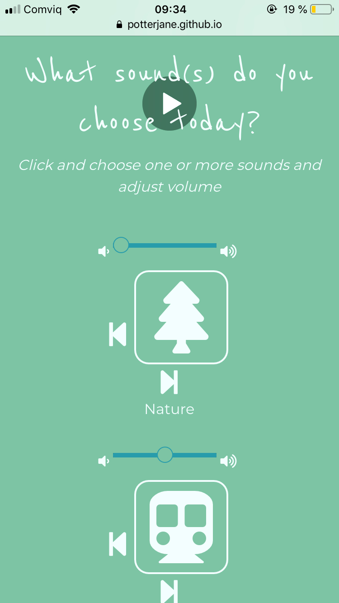
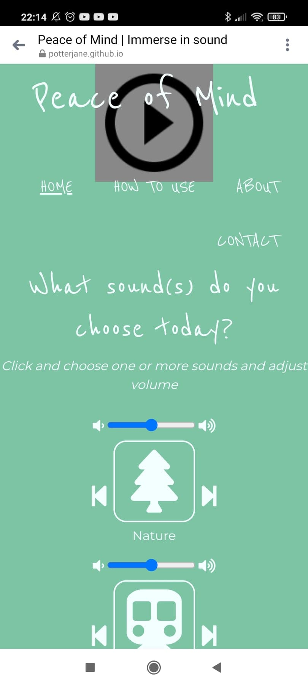
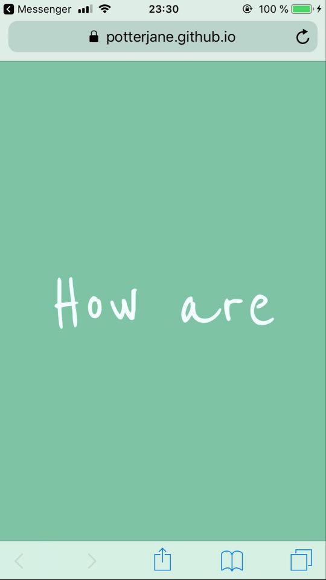
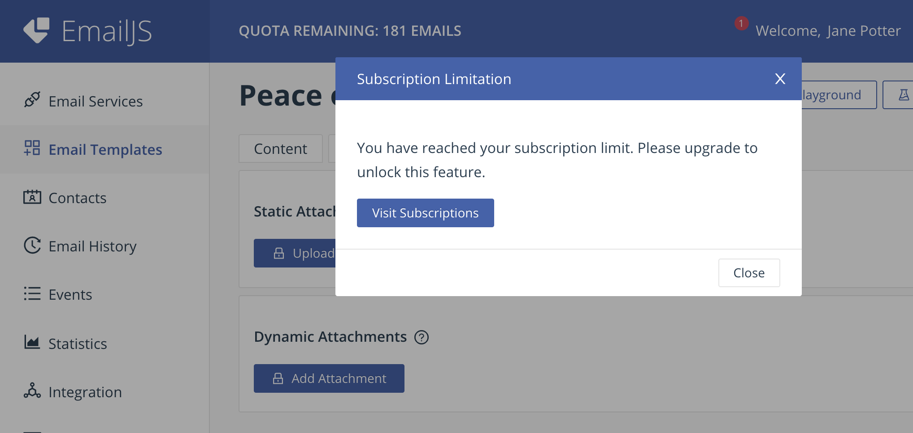
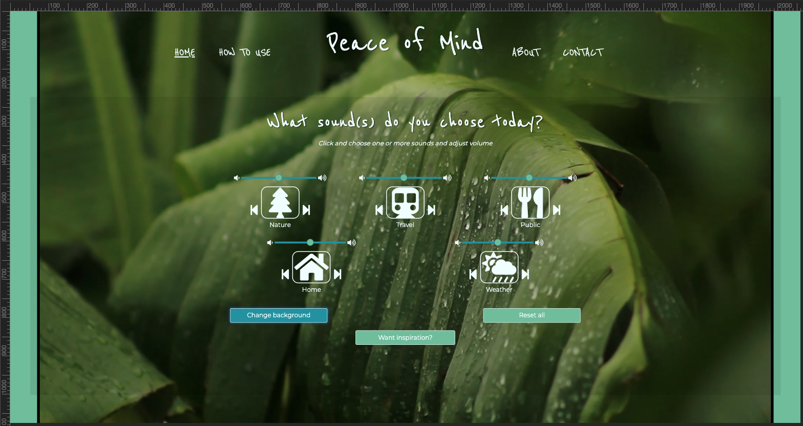

# Peace of Mind - Testing details

Click [here](README.md) for the website's README file

View the website [here](https://potterjane.github.io/peace-of-mind/)

## Table of Contents

1. [**Automated Testing**](#automated-testing)
    - [**Validation services**](#validation-services)
    - [**Accessibility services**](#accessibilty-services)
    - [**Other Evaluation services via Lighthouse**](#other-evaluation-services-via-lighthouse)
2. [**User Stories Testing**](#user-stories-testing)
3. [**Manual Testing**](#manual-testing)
    - [**Testing on desktop, tablet and phone screens**](#testing-on-desktop-tablet-and-phone-screens)
4. [**Bugs discovered**](#bugs-discovered)
    - [**Solved bugs**](#solved-bugs)
    - [**Unsolved bugs**](#unsolved-bugs)
5. [**Further Testing**](#further-testing)

## Automated Testing

### Validation services
- [W3C Markup Validation](https://validator.w3.org/) was used to validate all the HTML pages. Copied all the code from an html page, pasted it in the field under 'Validate by direct input' and then clicked on the 'Check' button.

**For this website, no errors or warnings to show on any of the HTML pages.**
- [W3C CSS validation](https://jigsaw.w3.org/css-validator/) was used to validate CSS. Copied all the code from the css page, pasted it in the field under 'By direct input' and then clicked on the 'Check' button.

**For this website, no errors or warnings to show on the CSS page.**
- [JSHint](https://jshint.com/) was used to validate all the JS pages. Copied all the code from a JS page, pasted it in the left-side of the tool.

**For this website, no errors or warnings to show on any of the JS pages.**

### Accessibility services
- [Lighthouse in ChromeDev Tools](https://developers.google.com/web/tools/lighthouse#devtools) was used to evaluate the accessibilty on all of the website's page in incognito mode, as recommended (see screenshot below).
<div align="center"><h4>Lighthouse error outside incognito mode</h4>

</div>
In order to run a Lighthouse report, open Google Chrome, go to the URL for [Peace of Mind](https://potterjane.github.io/peace-of-mind/) and then open Chrome DevTools. 
Change from the Elements tab to the Lighthouse tab (You might need to click on 'right arrows' icon to access this tab). Choose at least one category and a device and then click on 'Generate report'.

**The report generated an Accessibility rate of 100 out of 100 for the following pages: 404 error page, How To Use page, and About page.**

**The Home page generated an Accessibility rate of 91 out of 100 and the Contact page generated an Accessibility rate of 90 out of 100. Both pages got this rating for the same reason:**

<div align="center"><h4>Accessibility rating for Home page</h4>

</div>
<div align="center"><h4>Accessibility rating for Contact page</h4>

</div>

As you can see here, the form elements do actually have associated labels but the label element has been set to ```label{display: none;}``` in CSS. Since the accessibility rating has a valid reason but cannot be 'fixed' without changing the design of the pages, this developer chose to leave it on this Accessibility rating.

**Snippet of the HTML for Home page**
```html
<div class="row">
  <!--Travel sounds-->
  <div class="travel col">
    <i class="fas fa-volume-down"></i>
    <label for="volume-travel-small">Volume</label>
    <input type="range" id="volume-travel-small"> <!--Code taken from StackOverflow on how to add volume slider in HTML-->
    <i class="fas fa-volume-up"></i>
    <br>
    <i class="fas fa-step-backward" onclick="randomTravelSmall()"></i><i id="travel-icon-small" class="fas fa-fw fa-subway main-icon"></i><i class="fas fa-step-forward" onclick="randomTravelSmall()"></i>
    <audio loop id="travel-sound-small">
      <source src="#" type="audio/mp3" id="sourceTravelSmall">
      Your browser does not support embedded audio.
    </audio>
    <p>Travel</p>
  </div>
</div>
```
**Snippet of the HTML for Contact page**
```html
<div class="row">
  <div class="col">
    <label for="uploadfile" class="upload-label">Want to send us something?</label>
    <input type="file" id="uploadfile" name="uploadfile">
  </div>
</div>
```

- [WAVE Web Accessibility Evaluation Tool](https://wave.webaim.org/) was also used to evaluate the accessibilty on all of the website's pages in incognito mode. You simply need to write the URL for [Peace of Mind](https://potterjane.github.io/peace-of-mind/) and then press 'Enter' to get the results.

**The results were no errors were detected for this website.**

### Other Evaluation services via Lighthouse
- [Lighthouse in ChromeDev Tools](https://developers.google.com/web/tools/lighthouse#devtools) was also used to evaluate performance, best practices and SEO on all of the website's pages in incognito mode.

**The report generated a Performance rate an average of 94.7 out of 100 for this website.**
**The report generated a Best Practices rate of 100 out of 100 for this website.**
**The report generated a SEO rate of 100 out of 100 for this website.**

## User Stories Testing
In this section, this developer manually tested all the user stories described on the [README](README.md) page, under the UX section.

1. As a new or returning user, I want to be able to use the website's sound effect clips, quotes and background videos with as few clicks as possible, so that I can get in to the right head space immediately.
8. As a music/video artist or web developer looking for a job, I want to be able to use the website's sound effect clips, quotes and background videos in an easy way in order to know what the company's forte is and where there is room for improvement, so that I know how I can potentially collaborate and be a part of the company.

| Feature | Action | Expected result | Actual result |
| ------------- | ------------- | -------------   | ------------- |
| On the Home page, find the sound effects | Click on one of the sound effects icon or its corresponding previous/next button | A random sound effect is playing and the type of sound effect matches the theme of the sound effects icon. The sound effects icon is also replaced with a stop icon | Works as expected |
| On the Home page, find the stop button | Click on one of the sound effects icon or its corresponding previous/next button and then click the same sound effects icon to stop playing the sound effect | When user clicks the stop icon, the sound effect stops playing immediately | Works as expected |
| On the Home page, find the volume slider | Click on one of the sound effects icon or its corresponding previous/next button and then move the volume slider left and right | When user moves the volume slider to the left, it decreases the volume and when user moves it to the right, it increases the volume | Works as expected |
| On the Home page, find the background images | Click on the 'Change background' button | A random video is playing in the background of the page, muted and on a loop until user clicks on the button again to change to a different background video | Works as expected |
| On the Home page, find the quotes | Click on the 'Want inspiration?' button | A random quote and its author is displayed under the button. It remains on display until user clicks on the button again to change to a different quote | Works as expected |

<br>

2. As a new or returning user, I want to be able to reset all features with one click.

| Feature | Action | Expected result | Actual result |
| ------------- | ------------- | -------------   | ------------- |
| On the Home page, start playing one or several of the sound effects via their icon and then find the 'Reset all' button | Click on the 'Reset all' button | When a sound effect clip is playing, click on the button to cancel the action/reload the page  | Works as expected |
| On the Home page, start playing a background video by clicking on the 'Change background' button and then find the 'Reset all' button | Click on the 'Reset all' button | When a background video is playing, click on the button to cancel the action/reload the page | Works as expected |
| On the Home page, start displaying a random quote by clicking on the 'Want inspiration?' button and then find the 'Reset all' button | Click on the 'Reset all' button | When a quote and its author is on display, click on the button to cancel the action/reload the page | Works as expected |

<br>

3. As a new or returning user, I want to be able to find and follow instructions in an easy way, so that I know how to best use the website.

| Feature | Action | Expected result | Actual result |
| ------------- | ------------- | -------------   | ------------- |
| Find the How To Use page | Click on 'How To Use' on the top of the page in the navigation section | To send user to the How To Use page where and ordered list of instructions and its corresponding icons/button to illustrate the instructions are seen | Works as expected |

<br>

4. As a new or returning user, I want to be able to know the background of the company, so that I understand what they want us to achieve when using the website.
9. As a music/video artist or web developer looking for a job, I want to be able to know the background of the company, so that I can come to a decision on whether or not to apply for a job with the company.

| Feature | Action | Expected result | Actual result |
| ------------- | ------------- | -------------   | ------------- |
| Find the About page | Click on 'About' on the top of the page in the navigation section | To send user to the About page where background information about the website and what they aim to achieve is seen | Works as expected |

<br>

5. As a new or returning user, I want to know what other users think of their website, so that I can see what kind of users use the website and why.

| Feature | Action | Expected result | Actual result |
| ------------- | ------------- | -------------   | ------------- |
| Find the social links in the footer section of the Home page | Scroll down and click on one of the social icons on the left-hand side of the page  | When clicked the home page of the equivalent social link is opened on a new tab | Works as expected |
| Find the social links in the footer section of the How To Use page | Scroll down and click on one of the social icons on the left-hand side of the page  | When clicked the home page of the equivalent social link is opened on a new tab | Works as expected |
| Find the social links in the footer section of the About page | Scroll down and click on one of the social icons on the left-hand side of the page  | When clicked the home page of the equivalent social link is opened on a new tab | Works as expected |
| Find the social links in the footer section of the Contact page | Scroll down and click on one of the social icons on the left-hand side of the page  | When clicked the home page of the equivalent social link is opened on a new tab | Works as expected |

<br>

6. As a new or returning user, I want to be able to contact the company in an easy way, so that I can send any questions or feedback I might have with as few clicks as possible.
10. As a music/video artist or web developer looking for a job, I want to be able to contact the company in an easy way, so that I can send questions and/or send my resume/CV/portfolio/personal letter.

| Feature | Action | Expected result | Actual result |
| ------------- | ------------- | -------------   | ------------- |
| Find the Contact page | Click on 'Contact' on the top of the page in the navigation section | To send user to the Contact page where an unfilled form is seen | Works as expected |
| Fill in the Contact page with correct input data  | Fill in all the required fields, attach a file and then click 'Submit' button | After submission, form is completely cleared and user gets an alert message that says 'Message successfully sent!'| Works as expected |
| Fill in the Contact page with correct input data | Fill in all the required fields, do not attach a file and then click 'Submit' button | After submission, form is completely cleared and user gets an alert message that says 'Message successfully sent!'| Works as expected |
| Fill in the Contact page with incorrect input data | Fill in all the required fields except for 'Name' field and then click 'Submit' button | To receive a pop-up error message under the 'Name' field that states 'Please fill in this field'| Works as expected |
| Fill in the Contact page with incorrect input data | Fill in all the required fields except for 'E-mail' field and then click 'Submit' button | To receive a pop-up error message under the 'E-mail' field that states 'Please fill in this field' alternatively 'Please include an "@" in the email address' | Works as expected |
| Fill in the Contact page with incorrect input data | Fill in all the required fields except for 'Message' field and then click 'Submit' button | To receive a pop-up error message under the 'Message' field that states 'Please fill in this field'| Works as expected |

<br>

7. To have an easy way to navigate back to the Home page, so that if I ever get lost, I can get back to the where I need to be with as few clicks as possible.

| Feature | Action | Expected result | Actual result |
| ------------- | ------------- | -------------   | ------------- |
| On the 404 error page, find the button to the Home page | Click on the 'Go back to the Home page' button | To send user back to the Home page | Works as expected |
| Open the 404 error page, find the navigation bar | Go to the top of the page and click on any links in the navigation bar  | To send user to the selected existing page on the website | Works as expected |

<br>

## Manual Testing

### Testing on desktop, tablet and phone screens
Several tests were done on a smaller laptop screen and a bigger stationary computer screen and on the following browsers: Brave, Chrome, Edge, Firefox and Opera.
[Here](https://github.com/potterjane/peace-of-mind/blob/master/assets/screenshots/desktop/pom-desktop.pdf) you can find all of the screenshots of the website on a desktop screen (Macbook laptop). These screenshots were collected using [Balsamiq](https://balsamiq.com/). 

Several tests were done on a Poco mobile screen, iPhone 6 mobile screen, iPhone 8 mobile screen, Huawei mobile screen and Samsung mobile screen and on the following browsers: Chrome, Safari and via Facebook Messenger. You can find all of the screenshots of the website on Chrome DevTools' tablet (iPad) [here](https://github.com/potterjane/peace-of-mind/blob/master/assets/screenshots/tablet/pom-tablet.pdf) and for mobile screen (iPhone 6/7/8 Plus) [here](https://github.com/potterjane/peace-of-mind/blob/master/assets/screenshots/mobile/pom-mobile.pdf).

You can compare the desktop, tablet and mobile screenshots with the [third and final version](https://github.com/potterjane/peace-of-mind/blob/master/wireframes/pom-wireframes-version-3.pdf) of the wireframes.

**For testing, this developer followed these steps:**

1. The Welcome page is shown when user first visits the website. In front of a dark blue-green background, the letters are being displayed at the center of the page, one letter at a time. The Welcome page transitions to the Home page in a fade-out effect.
2. The page links in the navigation bar sends user to the correct page when clicked. No broken links on the static navigation bar or on the collapsed sidebar.
3. The company title is displayed at the top-center on all of the pages. When clicked, it sends user to the Home page. No broken links.
4. When URL is incorrectly filled in or user somehow ends up on a non-existing page, it sends user to the 404 error page. User can click on the page links in the navigation bar or click on the 'Go back to the Home page' button to send user back to the Home page. No broken links.
5. The sound effect icons play random sound effect clip when clicked and the stop icon replaces the playing sound effects icon.
6. The previous/next icons next to the corresponding sound effects icon plays random sound effect clip when clicked and the stop icon replaces the sound effects icon.
7. When sound effect clip is playing, user can move the corresponding volume slider to adjust the volume. When user slides the volume to the left, the volume decreases. When user slides the volume to the right, the volume increases.
8. When user clicks the stop icon, the sound effect clip stops playing immediately and the sound effect icon replaces the stop icon.
9. The 'Change background' button, when clicked, plays a random video in the background of the Home page, muted and in a loop. When user clicks the button again, a new random video plays in the background.
10. The 'Want inspiration?' button, when clicked, displays a random quote and its author under the button on the Home page. When user clicks the button again, a new random quote and its author is shown under the button.
11. The 'Reset all' button, when clicked, cancels the sound effects clips/background videos/quotes that is being played/displayed by reloading the page.
12. When clicked, all the links and icons in the footer section of the pages opens its corresponding link in a new tab. No broken links.
13. On the How To Use page, all the buttons are (intentionally) unclickable since they are only used to illustrate the instructions. 
14. On the About page, the two links opens to the How To Use page and the Contact page, respectively. It does not open the pages in a new tab.
15. When user submits the form with correct input data, an alert pops up with the message, 'Message successfully sent!'. All fields are required except for the upload file field.
16. When user submits the form with incorrect input data, error messages pop up under the field where the user has not filled properly. 

All devices were able to pass all tests, except the older iPhone model, the iPhone 6: that did not pass test number 7. This developer was not able to find a solution to this.

Brave Browser: Website and user stories work as expected. <br>
Microsoft Edge: Website and user stories work as expected. <br>
Google Chrome: Website and user stories work as expected. <br>
Opera: Website and user stories work as expected. <br>
Safari: Website and user stories work as expected. <br>
Firefox: Website and user stories work as expected.

## Bugs discovered

### Solved bugs
1. **Playback button visible in the background**

    Playback button was visible in the background on mobile devices when no video was playing 
    
    <div align="center"><h4>Playback visible on iPhone</h4>
    
    </div>

    <div align="center"><h4>Playback visible on Poco phone</h4>
    
    </div>

    **How this developer fixed it:**
    Removed the 'Change background' button and function from the smaller mobile screen sizes in index.html.

2. **Background videos not visibly playing due to main background image**

    Background videos have z-index: -5. When user clicks the 'Change background' button, no videos are visibly showing because it is playing behind the background image. 

    **How this developer fixed it:**
    Added the removeClass to remove the background image in when the changeBackground() function is called. See this developer's code on assets/js/videos.js with comments.

3. **Entire Welcome text not showing**

    The Welcome text, 'How are you feeling?' was not entirely visible on mobile or smaller screen sizes.

    <div align="center"><h4>Incomplete Welcome text on mobile</h4>
    
    </div>

    **How this developer fixed it:**
    Tried at first to break the text to two rows but that did not work. Instead, decreased the font size for mobile and smaller screens sizes.

4. **Sound effect clips does not resume to where it was paused**

    When user clicks on a sound effect icon, the audio is playing and displays the pause icon. When user clicks the pause icon, audio stops, it does not pause. So when user clicks the audio again, they might think that it will resume the audio because of the pause icon but it instead plays a new random sound effect clip from the start.

    **How this developer fixed it:**
    Replaced the pause icon with the stop icon. With the current function that does play/stop of the audio, this icon replacement makes more sense. 

5. **Cannot recieve file uploads when user submits form**

    When user submit their form successfully on the Contact page, this developer recieves all the required input data to their inbox but not the uploaded file. 

    **How this developer fixed it:**
    This developer did not fix it, but it did found the source of the 'bug'. EmailJS requires that the developer upgrades their subscription in order to unlock this feature.

    This developer felt that this step was unnecessary for the project.

    <div align="center"><h4>EmailJS subscription limit</h4>
    
    </div>

### Unsolved bugs

1. **Console error**

    The console error, “The play() request was interrupted by a call to pause()” is seen when user clicks on sound effect icon or previous/next icon and then clicks on the previous/next icon to play next random sound effect clip before the sound effect clip reaches the end.

    This error does not affect the feature's function. However, this developer was not able to fix console error, tried to follow the instructions in the post on [StackOverflow](https://stackoverflow.com/questions/36803176/how-to-prevent-the-play-request-was-interrupted-by-a-call-to-pause-error) but the error remained.

2. **Volume adjuster not working on iPhone 6**

    Volume slider is visible and user can move the slider left to right (and vice versa) but it does not decrease/increase the volume when moved.

    This developer has not been able to find a solution to this at present date.

3. **Background video does not fully cover on larger screens**

    For screens larger than 1920px in width, some (not all) of the background videos does not fully cover the background.

    <div align="center"><h4>Video not fully covered in background of larger screen</h4>
    
    </div>

    Tried to add the following code to the ```id="bg-video"``` in CSS but it did not solve the bug and have tried to search for the solution online, but have not found anything at present date.

    ```CSS
    #bg-video {
        width: 100%;
        height: auto;
        object-fit: cover;
    }
    ```

## Further testing

- Used Chrome DevTools repeatedly throughout the project to test the website on all the different
devices and orientations available in the built-in tool.
- Asked friends and family to test out the website on their devices to see if there were any 
further issues found.